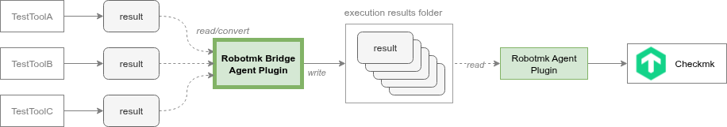
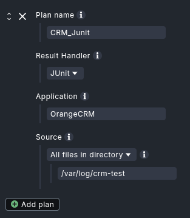
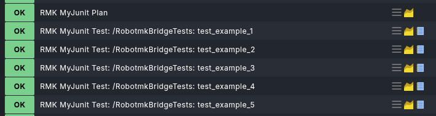

# Robotmk Bridge Plugin

> Connect **any test automation tool** to Checkmk monitoring — no test rewrites needed.

[](https://checkmk.com)
[](https://www.python.org/)
[](LICENSE)

The Robotmk Bridge Plugin extends [Checkmk](https://checkmk.com)'s synthetic monitoring to support test results from **any testing framework** — JUnit, Gatling, OWASP ZAP, and more in the future — without requiring migration to Robot Framework.

## Why Robotmk Bridge?

Until now, comprehensive test result integration in Checkmk was exclusively available for **Robot Framework** via [Robotmk](https://robotmk.org/). 

Many teams wanted this integration but couldn't change their established test frameworks.

The **Robotmk Bridge** solves this by acting as a universal translator: it takes test results from your existing tools and converts them into a format Checkmk can monitor and visualize.

### Key Benefits:

- ✅ **Keep your testing tools** — Works with JUnit, Gatling, ZAP, and more in the future
- ✅ **No code changes** — Processes existing test result files
- ✅ **Unified monitoring** — All test results appear as Checkmk services
- ✅ **Fully configurable** — Set up entirely through Checkmk GUI (="Bakery")
- ✅ **Extensible** — New Python handlers can be added to support more test tools
- ✅ **Cross-platform** — Works on Linux and Windows

## How It Works



- **Your test tool** generates result files (JUnit XML, Gatling logs, ZAP reports, etc.)
- **Bridge plugin** (deployed via Checkmk agent) picks up these files
- **Handler module** converts the native format to Robot Framework XML
- **Robotmk format** wraps the converted results in JSON
- **Checkmk** displays results as monitoring services with metrics and states


## Quick Start

### 1. Install Prerequisites

On the monitored host, you need **Python 3.7+** and the `robotframework-robotmk-bridge` package:

```bash
# Linux
pip3 install robotframework-robotmk-bridge==0.1.1

# Windows
pip install robotframework-robotmk-bridge==0.1.1
```

### 2. Install the Plugin

1. Download the latest MKP from [Github Releases](https://github.com/elabit/robotmk-bridge-plugin/releases) or [Checkmk Exchange](https://exchange.checkmk.com/p/robotmk-bridge)
2. In Checkmk: **Setup** → **Extension packages** → **Upload package**
3. Upload and install the MKP in Chekcmk

### 3. Configure via Bakery

In this step you define how the plugin should find and process your test result files. You can set up as many "plans" as you want to monitor different test suites or tools.



1. Go to **Setup** → **Agents** → **Agent rules**
2. Find "Robotmk Bridge"
3. Create a new rule and choose "Add plan"
   1. **Plan Name**: Unique identifier for this plan. Used as the Robotmk plan ID.
   2. **Result Handler**: Select the result handler that matches the test tool producing the result files.
   3. **Application**: Application name shown in the Checkmk service description and discovered as service label.
   4. **Source**: Choose between the following options to specify where the plugin should look for test result files:
      - **Single file**: exact path to a single result file, always processed if it exists.
      - **Newest in directory**: Provide a directory path; the plugin will process the most recently modified file in that directory.
      - **All files in directory**: Provide a directory path; the plugin will process *all files* in that directory .
4. Bake and deploy the agent

### 4. Monitor Results

Run the discovery on the host to see the new services created by the plugin. You should see:

- **RMK <plan> Plan**: Overall status of the result conversion, including runtime metric
- **RMK <plan> Test**: Dependin on the source type, you will see either a single service with aggregated test results (for single file or newest in directory) or multiple services for each test result file (for all files in directory)

🎉 **Done!** Your 3rd party test results now appear as Checkmk monitoring services - powered by Robotmk:



## Supported Test Tools

Currently, we support results from these tools: 

| Tool | Handler | Result Format |
|------|---------|---------------|
| pytest, JUnit, Maven, NUnit | `junit` | JUnit XML |
| Gatling | `gatling` | simulation.log |
| OWASP ZAP | `zaproxy` | XML/JSON reports |
| _More coming soon_ | — | — |

Checkout [robotmk-bridge](https://github.com/elabit/robotmk-bridge) for writing handlers or to submit an [issue](https://github.com/elabit/robotmk-bridge/issues) or a [Pull request](https://github.com/elabit/robotmk-bridge/pulls).

## Documentation

- **📖 [User Guide](docs/user-guide.md)** — Complete installation, configuration, and troubleshooting guide
- **🏗️ [Architecture](docs/architecture.md)** — Technical design and component overview
- **🔧 [Development Guide](docs/development-guide.md)** — Contributing and extending the plugin
- **⚙️ [Taskfile Guide](docs/taskfile-guide.md)** — Development tasks and workflows

## Features

### Configuration

- **Bakery-based setup** — No manual agent configuration needed
- **Multiple test plans** — Monitor different test types per host
- **Flexible file sources** — Single file, newest in directory, or all files
- **Handler parameters** — Customize behavior per test tool

### Monitoring

- **Service per plan** — Individual monitoring for each test configuration
- **Comprehensive metrics** — Execution time, pass/fail counts, conversion duration
- **Configurable thresholds** — Set WARN/CRIT levels for missing files and slow conversions
- **Error reporting** — Clear diagnostics when something goes wrong

### Platform Support

- **Linux** — Bash wrapper with automatic Python detection
- **Windows** — PowerShell wrapper with Python discovery
- **Graceful degradation** — Clear error messages when dependencies are missing

## Development

For the best development experience, use [VS Code](https://code.visualstudio.com/) with the [Dev Containers](https://marketplace.visualstudio.com/items?itemName=ms-vscode-remote.remote-containers) extension.

```bash
# Install Task runner (optional but recommended)
brew install go-task/tap/go-task  # macOS
# or: snap install task --classic   # Linux

# Common tasks
task test          # Run all tests
task gen-data      # Generate test data
task validate      # Format, lint, and test
```

See [DEVELOPMENT.md](DEVELOPMENT.md) for more details.

## Directories

The following directories in this repo are getting mapped into the Checkmk site.

- `agents`, `checkman`, `checks`, `doc`, `inventory`, `notifications`, `pnp-templates`, `web` are mapped into `local/share/check_mk/`
- `agent_based` is mapped to `local/lib/check_mk/base/plugins/agent_based`
- `nagios_plugins` is mapped to `local/lib/nagios/plugins`

## Continuous integration

### Local


`pytest` can be executed from the terminal or the test ui.

## About

Developed by [ELABIT GmbH](https://elabit.de) — the creators of [Robotmk](https://robotmk.org)

- **Robotmk Website**: https://robotmk.org
- **Robotmk Blog**: https://blog.robotmk.org
- **Issues**: https://github.com/elabit/robotmk-bridge-plugin/issues
- **Bridge Handler Development**: https://github.com/elabit/robotmk-bridge

---

**Made with ❤️ to extend Checkmk Synthetic Monitoring to every test automation tool!**
