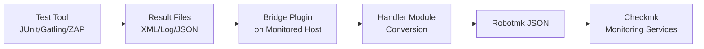

# Robotmk Bridge Plugin

> Connect **any test automation tool** to Checkmk monitoring — no test rewrites needed.

[](https://checkmk.com)
[](https://www.python.org/)
[](LICENSE)

The Robotmk Bridge Plugin extends [Checkmk](https://checkmk.com)'s synthetic monitoring to support test results from **any testing framework** — JUnit, Gatling, Playwright, Cypress, OWASP ZAP, and more — without requiring migration to Robot Framework.

## Why Robotmk Bridge?

Until now, comprehensive test result integration in Checkmk was exclusively available for Robot Framework via [Robotmk](https://robotmk.org/). Many teams wanted this integration but couldn't change their established test frameworks.

**Robotmk Bridge solves this** by acting as a universal translator: it takes test results from your existing tools and converts them into a format Checkmk can monitor and visualize.

### Key Benefits

- ✅ **Keep your tests** — Works with JUnit, pytest, Gatling, ZAP, NUnit, xUnit, and more
- ✅ **No code changes** — Processes existing test result files
- ✅ **Unified monitoring** — All test results appear as Checkmk services
- ✅ **Fully configurable** — Set up entirely through Checkmk GUI (Bakery)
- ✅ **Extensible** — Add new test tool support via handler modules
- ✅ **Cross-platform** — Works on Linux and Windows


## How It Works



1. **Your test tool** generates result files (JUnit XML, Gatling logs, ZAP reports, etc.)
2. **Bridge plugin** (deployed via Checkmk agent) picks up these files
3. **Handler module** converts the native format to Robot Framework XML
4. **Robotmk format** wraps the converted results in JSON
5. **Checkmk** displays results as monitoring services with metrics and states


## Quick Start

### 1. Install Prerequisites

On monitored hosts:
```bash
# Linux
pip3 install robotframework-robotmk-bridge==0.1.1

# Windows
pip install robotframework-robotmk-bridge==0.1.1
```

### 2. Install the Plugin

1. Download the [latest MKP package](https://github.com/elabit/robotmk-bridge-plugin/releases)
2. In Checkmk: **Setup** → **Extension packages** → **Upload package**
3. Upload and install the MKP

### 3. Configure Via Bakery

1. Go to **Setup** → **Agents** → **Agent rules**
2. Find "Robotmk Bridge Plugin configuration"
3. Add a rule with your test configuration:

```yaml
Plans:
  - Plan Name: my_api_tests
    Application: API Integration Tests
    Handler: JUnit
    Source:
      Mode: Single file
      Path: /var/tests/api/results.xml
```

4. Bake and deploy the agent

### 4. Monitor Results

Navigate to your host in Checkmk and find:
- **RMKBridge**: Overall bridge plugin status
- **RMKBridge Plan: my_api_tests**: Individual test plan results

🎉 **Done!** Your test results now appear as Checkmk monitoring services.

## Supported Test Tools

Currently, we support results from these tools: 

| Tool | Handler | Result Format |
|------|---------|---------------|
| pytest, JUnit, Maven, NUnit | `junit` | JUnit XML |
| Gatling | `gatling` | simulation.log |
| OWASP ZAP | `zaproxy` | XML/JSON reports |
| _More coming soon_ | — | — |

Checkout [robotmk-bridge](https://github.com/elabit/robotmk-bridge) for writing handlers.

## Documentation

- **📖 [User Guide](docs/user-guide.md)** — Complete installation, configuration, and troubleshooting guide
- **🏗️ [Architecture](docs/architecture.md)** — Technical design and component overview
- **🔧 [Development Guide](docs/development-guide.md)** — Contributing and extending the plugin
- **⚙️ [Taskfile Guide](docs/taskfile-guide.md)** — Development tasks and workflows

## Features

### Configuration

- **Bakery-based setup** — No manual agent configuration needed
- **Multiple test plans** — Monitor different test types per host
- **Flexible file sources** — Single file, newest in directory, or all files
- **Handler parameters** — Customize behavior per test tool

### Monitoring

- **Service per plan** — Individual monitoring for each test configuration
- **Comprehensive metrics** — Execution time, pass/fail counts, conversion duration
- **Configurable thresholds** — Set WARN/CRIT levels for missing files and slow conversions
- **Error reporting** — Clear diagnostics when something goes wrong

### Platform Support

- **Linux** — Bash wrapper with automatic Python detection
- **Windows** — PowerShell wrapper with Python discovery
- **Graceful degradation** — Clear error messages when dependencies are missing

## Development

For the best development experience, use [VS Code](https://code.visualstudio.com/) with the [Dev Containers](https://marketplace.visualstudio.com/items?itemName=ms-vscode-remote.remote-containers) extension.

```bash
# Install Task runner (optional but recommended)
brew install go-task/tap/go-task  # macOS
# or: snap install task --classic   # Linux

# Common tasks
task test          # Run all tests
task gen-data      # Generate test data
task validate      # Format, lint, and test
```

See [DEVELOPMENT.md](DEVELOPMENT.md) for more details.

## Contributing

Contributions are welcome! Please:

1. Fork the repository
2. Create a feature branch
3. Make your changes
4. Add tests for new functionality
5. Submit a pull request

For adding support for new test tools, see [robotmk-bridge](https://github.com/elabit/robotmk-bridge).

## Project Structure

```
robotmk-bridge-plugin/
├── agents_plugins/          # Agent plugin (Python + wrappers)
│   ├── robotmk_bridge_plugin.py      # Main plugin logic
│   ├── robotmk_bridge_plugin.sh       # Linux wrapper
│   └── robotmk_bridge_plugin.ps1      # Windows wrapper
├── bakery/                  # Bakery backend
│   └── robotmk-bridge-plugin.py
├── checks/                  # Check plugin
│   └── robotmk_bridge_plugin.py
├── web_plugins/            # WATO rules (Bakery + Check params)
│   └── wato/
├── docs/                   # Documentation
│   └── user-guide.md       # Complete user guide
├── tests/                  # Test suite
│   ├── agent_plugin/       # Agent plugin tests
│   ├── check/              # Check plugin tests
│   ├── e2e/                # End-to-end tests
│   └── data_generator/     # Test data generator
└── handlers.yaml           # Handler registry
```

## License

This project is licensed under the GNU General Public License v2.0 - see the [LICENSE](LICENSE) file for details.

## About

Developed by [ELABIT GmbH](https://elabit.de) — Creators of [Robotmk](https://robotmk.org)

- **Website**: https://robotmk.org
- **Issues**: https://github.com/elabit/robotmk-bridge-plugin/issues
- **Handler Development**: https://github.com/elabit/robotmk-bridge

---

**Made with ❤️ to extend Checkmk Synthetic Monitoring to every test automation tool**
